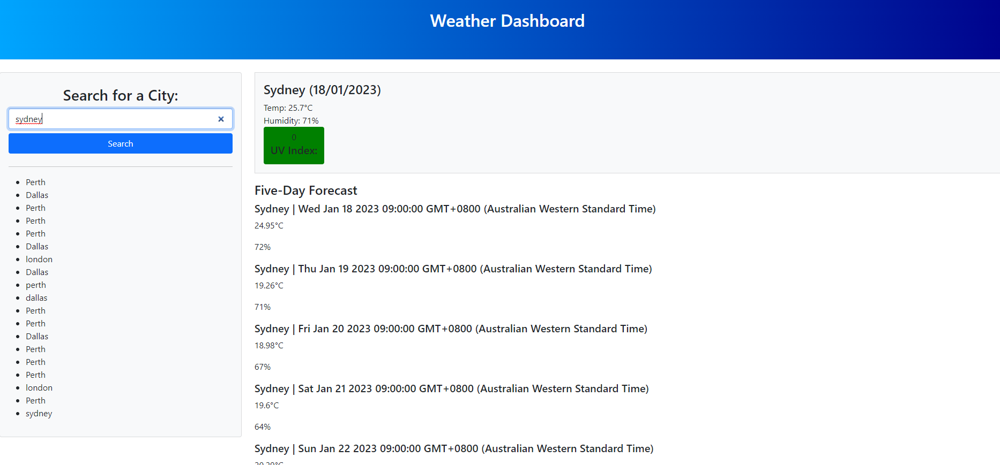

# Weather-Dashboard

## Description

This is a weather dashboard to let the user see the current forecast and 5 day forecast of the city they are searching. The user will type in a city and the app will show the information and also save the information to a history for them to view previously searched cities.

## Technologies

- HTML
- CSS (Bootstrap)
- JavaScript (with JQuery)

## Screenshot

